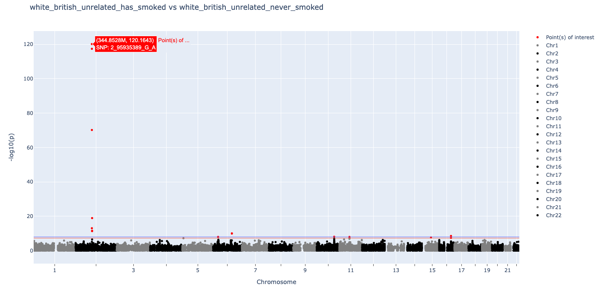

# isGWAS (in-silico GWAS), using Spark and Apollo Germline Data Model

Computes case-control GWAS statistics using only sufficient statistics (cohort allele frequencies and sample sizes)
according to methods described in [Foley et al.](https://www.biorxiv.org/content/10.1101/2023.07.21.550074v3.full.pdf)

## Inputs
- Case Cohort Object
- Control Cohort Object
- Genotype Table (default: 'genotype_23157', a table containing information from UKB Data-Field 23157)
- Minimum MAF (default: 0.001)
- Firth Correction (default: false)
- Test Statistic (default: 'wald', options: 'wald', 'lrt')
- Output Name

## Outputs
### Results in CSV format, with columns:
- Variant: Variant ID as shown in database table
- FreqCases: Frequency of ALT allele for cases
- Ncases: Case sample size
- FreqControls: Frequency of ALT allele for controls
- Beta: Effect size estimate on log-odds scale
- SE: Standard error of effect size estimate
- log10p: P-value under null (Beta = 0) on -log10 scale

> | Variant | FreqCases | Ncases | FreqControls | Ncontrols | Beta | SE | log10p |
> |---------|-----------|--------|--------------|-----------|------|----|--------|
> | 10_100042614_C_G | 2.1069106669877197E-5 | 166120 | 3.1986547372076655E-5 | 109421 | -0.41751897 | 0.53453046 | 0.5010114 |
> | 10_100054427_C_T | 1.2039489525644112E-5 | 166120 | 4.5695067674395226E-6 | 109421 | 0.9687953 | 1.1180387 | 0.7567811 |
> | 10_100063711_G_A | 1.2039489525644112E-5 | 166120 | 1.3708520302318569E-5 | 109421 | -0.1298272 | 0.76376766 | 0.08416714 |
> | 10_100075854_A_C | 6.019744762822056E-6 | 166120 | 4.5695067674395226E-6 | 109421 | 0.27564105 | 1.2247481 | 0.12073011 |

### Interactive Manhattan Plot:

## Notes
- Firth Correction is not thoroughly tested.
- Variant effects assume an additive model on the un-standardized scale.
- Minimal QC (filtering of variants or samples) is performed. See [Foley et al.](https://www.biorxiv.org/content/10.1101/2023.07.21.550074v3.full.pdf) supplementary material for recommended QC steps.
- Currently no checking that case and control cohorts are disjoint.
- Tested using unrelated individuals, consisting of ~160K cases (Ever smokers) and ~110K controls (Never smokers). For all variants in genotype_23157 (~8M), this ran for ~20min. Most of that time was spent calculating allele frequencies.

